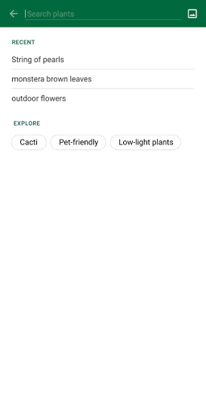
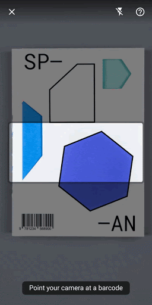

[](https://travis-ci.org/firebase/mlkit-material-android)

# Tapack X Google ML Kit

This app demonstrates how to build an end-to-end user experience with 
[Google ML Kit APIs](https://developers.google.com/ml-kit) and following the 
[new Material for ML design guidelines](https://material.io/collections/machine-learning/).

The goal is to make it as easy as possible to integrate ML Kit into your app with an experience 
that has been user tested for the specific use cases that are covered:

* Visual search using the Object Detection & Tracking API - a complete workflow from object
  detection to product search in live camera and static image
* Barcode detection using the Barcode API in live camera

 


## Steps to run the app

* Clone this repo locally
  ```
  git clone https://github.com/Razzaz/mlkit-material-android-master
  ```
* [Create a Firebase project in the Firebase console, if you don't already have one](https://firebase.google.com/docs/android/setup)
* Add a new Android app into your Firebase project with package name com.google.firebase.ml.md
* Download the config file (google-services.json) from the new added app and move it into the module folder (i.e. [app/](./app/))
* Build and run it on an Android device

## How to use the app

This app supports usage scenarios: Live Camera Barcode Scanning Activity.

### Live Camera scenario

It uses the camera preview as input and contains two workflow: barcode detection. There's also a Settings page to allow you to configure several options:

- Barcode detection
  - Barcode aiming frame size
  - Barcode size check: will prompt "Move closer" if the current detected barcode size is not big enough
  - Delay loading result: to simulate the case where the detected barcode requires further 
    processing before displaying result.

## License
© Google, 2019. Licensed under an [Apache-2](./LICENSE) license.
